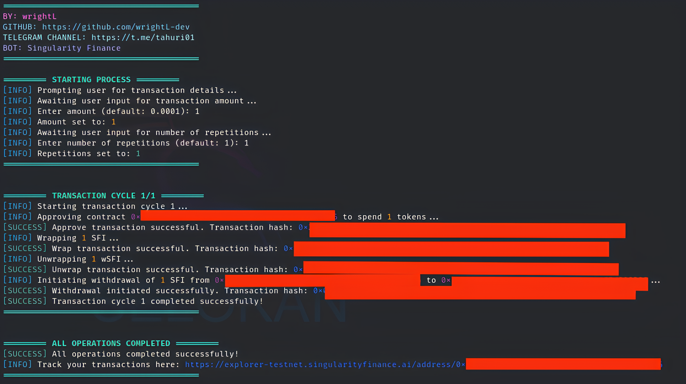

# Testnet Singularity Finance

## Fitur

- **Bridge**
- **Wrap Token**
- **Unwrap Token**
- **Custom Amount Token**
- **Random Delay 1-3 Seconds**



## Requirements

Before running this project, make sure you have installed:

- Node.js
- npm (Node Package Manager)

## Installation

1. **Clone this repository:**

    ```plaintext
    git clone https://github.com/wrightL-dev/SF
    cd SF

2. **Install the required packages:**

    ```plaintext
    npm install ethers dotenv

3. **Create a .env file and add the following configuration:**

    ```plaintext
   # RPC URLs
   SFI_TESTNET_RPC_URL="https://rpc-testnet.singularityfinance.ai"
   SEPOLIA_RPC_URL="https://eth-sepolia.g.alchemy.com/v2/fSkpxq5hiBurNDf6pCs4mqyLlDxHsH2Z"

   # Wallet Address
   FROM_ADDRESS="YOUR-WALLET-ADDRESS"
   TO_ADDRESS="YOUR-WALLET-ADDRESS"

   # Private key
   PRIVATE_KEY="YOUR-PRIVATE-KEY"
 
4. **Run the script:**

   ```plaintext
   node main.js

## Support

If you have any questions or need further assistance, feel free to join our Telegram channel at [t.me/tahuri01](https://t.me/tahuri01).

## License

This project is licensed under the [MIT License](LICENSE).
